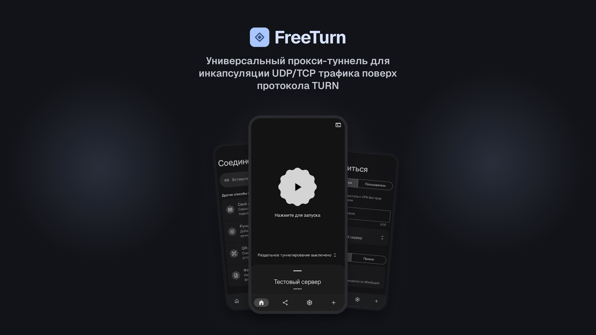

> **Disclaimer.** Проект предназначен **исключительно для образовательных и исследовательских целей.**

> **Важно:** При обновлении до версии 3.0.0 все настройки будут сброшены.

## Возможности

- **Добавление нескольких серверов**
- **Клонирование конфигурации серверов**
- **Быстрая установка на VPS**
- **Возможность делиться конфигами**
- **Режим работы прокси / VPN** (WireGuard)
- **Бэкапы**
- **Раздельное туннелирование**

## Требования

- **Android 6.0+** (API 23)
- **Архитектура процессора:** `arm64-v8a` или `armeabi-v7a`
- **VPS**
- **Ссылка на звонок**

## Благодарности

- **[@Moroka8](https://github.com/Moroka8)** — форк ядра [vk-turn-proxy](https://github.com/Moroka8/vk-turn-proxy)
- **[@alexmac6574](https://github.com/alexmac6574)** — форк ядра [vk-turn-proxy](https://github.com/alexmac6574/vk-turn-proxy)
- **[@cacggghp](https://github.com/cacggghp)** — оригинальное [vk-turn-proxy](https://github.com/cacggghp/vk-turn-proxy)
- **[@MYSOREZ](https://github.com/MYSOREZ)** — оригинальный Android-клиент [vk-turn-proxy-android](https://github.com/MYSOREZ/vk-turn-proxy-android)
