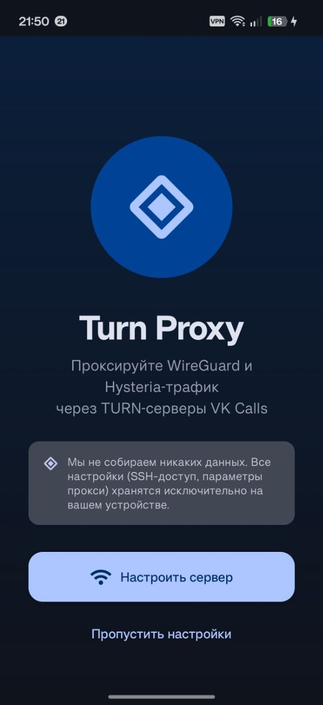
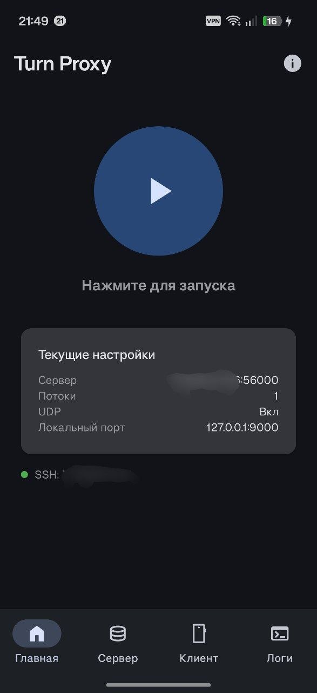

# FreeTurn — Android TURN Proxy

Android-клиент для [vk-turn-proxy](https://github.com/cacggghp/vk-turn-proxy) — проброс WireGuard/Hysteria-трафика через TURN-серверы VK Звонков и Яндекс Телемоста.

> **Disclaimer:** Проект предназначен исключительно для образовательных и исследовательских целей.

## Принцип работы

Пакеты шифруются DTLS 1.2 и отправляются на TURN-сервер по протоколу STUN ChannelData (TCP или UDP). TURN-сервер пересылает трафик по UDP на ваш VPS, где он расшифровывается и передаётся в WireGuard/Hysteria. Учётные данные для TURN генерируются автоматически из ссылки на звонок.

## Возможности

- **GUI и Raw режимы** — удобная форма с полями или ввод аргументов вручную
- **Управление сервером по SSH** — установка, запуск, остановка и мониторинг серверной части прямо из приложения (пароль или SSH-ключ)
- **Капча** — автоматическое обнаружение и решение через встроенный WebView без перезапуска процесса
- **Watchdog** — автоматический перезапуск при обрыве (до 8 попыток, экспоненциальный backoff)
- **Смена сети** — детектирование переключения Wi-Fi/Mobile и автоматическое переподключение
- **Кастомное ядро** — возможность загрузить свой бинарник вместо встроенного
- **Шифрование секретов** — SSH-пароли и ключи хранятся в EncryptedSharedPreferences (AES-256-GCM, Android Keystore)
- **TOFU** — верификация SSH-хостов по отпечатку (Trust On First Use)
- **Broadcast API** — управление прокси через intent (`START_PROXY` / `STOP_PROXY`) для автоматизации

## Скриншоты

<p float="left">
  
  
</p>

## Требования

- Android 8.0+ (API 26)
- ARM64-устройство (arm64-v8a)
- VPS с установленным WireGuard или Hysteria
- Ссылка на VK Звонок

## Быстрый старт

### 1. Серверная часть

Установите и запустите серверную часть на VPS:

```bash
# Скачать бинарник
wget https://github.com/cacggghp/vk-turn-proxy/releases/latest/download/server-linux-amd64

# Запустить
chmod +x server-linux-amd64
nohup ./server-linux-amd64 -listen 0.0.0.0:56000 -connect 127.0.0.1:<порт_wg> > server.log 2>&1 &
```

Или используйте встроенный SSH-менеджер в приложении — он скачает, установит и запустит серверную часть за вас.

### 2. Android-клиент

1. Установите APK из [Releases](../../releases)
2. Пройдите онбординг или пропустите его
3. Заполните настройки:
   - **Адрес сервера** — IP:порт вашего VPS (например `1.2.3.4:56000`)
   - **Ссылка** — ссылка VK Звонка
   - **Локальный адрес** — по умолчанию `127.0.0.1:9000`
4. Нажмите кнопку запуска. При успехе в логах появится `Established DTLS connection!`

### 3. WireGuard / Hysteria

В конфиге WireGuard-клиента:
- Endpoint: `127.0.0.1:9000`
- MTU: `1280`
- Добавьте FreeTurn в исключения (чтобы трафик приложения не шёл через туннель)

## Использование с V2Ray / Xray / Sing-box

Вместо стандартного WireGuard-клиента можно использовать любое ядро с его поддержкой.

<details>
<summary>Клиент (Xray JSON)</summary>

```json
{
    "inbounds": [
        {
            "protocol": "socks",
            "listen": "127.0.0.1",
            "port": 1080,
            "settings": { "udp": true },
            "sniffing": { "enabled": true, "destOverride": ["http", "tls"] }
        }
    ],
    "outbounds": [
        {
            "protocol": "wireguard",
            "settings": {
                "secretKey": "<client_secret_key>",
                "peers": [
                    {
                        "endpoint": "127.0.0.1:9000",
                        "publicKey": "<server_public_key>"
                    }
                ],
                "domainStrategy": "ForceIPv4",
                "mtu": 1280
            }
        }
    ]
}
```
</details>

<details>
<summary>Сервер (Xray JSON)</summary>

```json
{
    "inbounds": [
        {
            "protocol": "wireguard",
            "listen": "0.0.0.0",
            "port": 51820,
            "settings": {
                "secretKey": "<server_secret_key>",
                "peers": [{ "publicKey": "<client_public_key>" }],
                "mtu": 1280
            }
        }
    ],
    "outbounds": [
        { "protocol": "freedom", "settings": { "domainStrategy": "UseIPv4" } }
    ]
}
```
</details>

## Решение проблем

| Проблема | Решение |
|----------|---------|
| Ошибки DNS | Настройте WireGuard только для конкретных приложений (split tunneling) |
| Нестабильное соединение | Попробуйте отключить UDP-режим |
| Капча при запуске | Пройдите капчу в появившемся WebView — токен передастся автоматически |
| Прокси не запускается | Проверьте логи на вкладке «Логи», убедитесь что ссылка на звонок актуальна |

## Стек

- **Kotlin** + **Jetpack Compose** + **Material 3**
- **Coroutines / StateFlow** — реактивная архитектура
- **JSch** — SSH-клиент
- **EncryptedSharedPreferences** — шифрование секретов
- **DataStore** — хранение настроек
- Нативный бинарник на **Go** — `libvkturn.so` (arm64-v8a)

## Сборка

```bash
./gradlew assembleRelease
```

APK: `app/build/outputs/apk/release/app-release.apk`

## Лицензия

[GPL-3.0](LICENSE)
