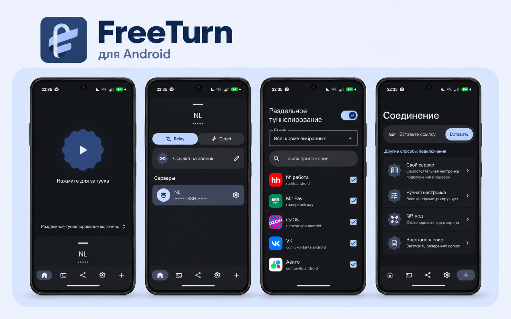

> **Disclaimer.** Проект предназначен **исключительно для образовательных и исследовательских целей.**

> [!WARNING]
> **Переход на версию 5 требует настройки приложения с нуля.** Перед обновлением сохраните данные доступа к своему VPS и параметры подключения. После обновления заново добавьте сервер или импортируйте новую ссылку на вкладке "Соединение" (+), затем проверьте параметры VPN и раздельного туннелирования. При первом запуске v5 после обновления приложение покажет однократное предупреждение.

## Возможности

- **Добавление нескольких серверов**
- **Клонирование конфигурации серверов**
- **Быстрая установка на VPS**
- **Возможность делиться конфигами**
- **Встроенный VPN** (WireGuard / AmneziaWG) без отдельного VPN-клиента
- **Локальный прокси** для внешнего клиента
- **Relay / Direct** - подключение через TURN или напрямую
- **Импорт подключения** по ссылке или QR-коду
- **Бэкапы**
- **Раздельное туннелирование**

## Требования

- **Android 7.0+** (API 24)
- **Архитектура процессора:** `arm64-v8a` или `armeabi-v7a`
- **VPS**
- **Ссылка на звонок** для режима Relay; для Direct не требуется

## Благодарности

- **[@Moroka8](https://github.com/Moroka8)** - форк ядра [vk-turn-proxy](https://github.com/Moroka8/vk-turn-proxy)
- **[@alexmac6574](https://github.com/alexmac6574)** - форк ядра [vk-turn-proxy](https://github.com/alexmac6574/vk-turn-proxy)
- **[@cacggghp](https://github.com/cacggghp)** - оригинальное [vk-turn-proxy](https://github.com/cacggghp/vk-turn-proxy)
- **[@MYSOREZ](https://github.com/MYSOREZ)** - оригинальный Android-клиент [vk-turn-proxy-android](https://github.com/MYSOREZ/vk-turn-proxy-android)
